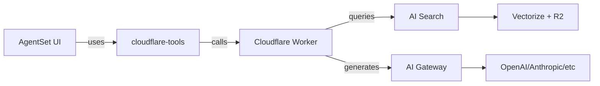

# AgentSet × Cloudflare Integration Documentation

This directory contains comprehensive documentation for integrating AgentSet UI with Cloudflare AI Search and AI Gateway.

## Documentation Structure

### Core Documentation

- **[Architecture Guide](./architecture.md)** - System architecture, data flow, and component interactions
- **[Getting Started](./getting-started.md)** - Quick start guide for new developers
- **[Integration Guide](./integration-guide.md)** - Step-by-step integration instructions
- **[Migration Guide](./migration-guide.md)** - How to migrate from local RAG to Cloudflare RAG
- **[API Reference](./api-reference.md)** - Complete API contract documentation
- **[Deployment Guide](./deployment-guide.md)** - Deployment strategies and CI/CD setup
- **[Admin Guide](./admin-guide.md)** - Operating and managing the integrated system

### Additional Resources

- **[Environment Configuration](./environment-config.md)** - Environment variables and configuration
- **[Troubleshooting](./troubleshooting.md)** - Common issues and solutions
- **[Cost Optimization](./cost-optimization.md)** - Tips for minimizing costs
- **[Security Best Practices](./security.md)** - Security considerations

## Quick Links

### For Product Managers
- [Architecture Overview](./architecture.md#high-level-overview)
- [Migration Strategy](./migration-guide.md#migration-strategy)
- [Cost Analysis](./cost-optimization.md)

### For Developers
- [Getting Started](./getting-started.md)
- [Integration Guide](./integration-guide.md)
- [API Reference](./api-reference.md)

### For DevOps
- [Deployment Guide](./deployment-guide.md)
- [Environment Configuration](./environment-config.md)
- [Monitoring & Observability](./admin-guide.md#monitoring)

### For System Administrators
- [Admin Guide](./admin-guide.md)
- [Security Best Practices](./security.md)
- [Troubleshooting](./troubleshooting.md)

## Repository Structure

```
agentset-cloudflare/
├── agentset/                     # AgentSet UI monorepo
│   ├── apps/web/                 # Next.js application
│   └── packages/
│       ├── cloudflare-tools/     # Client library for Worker
│       └── engine/               # RAG engine with CF adapter
│
├── agentset-cloudflare-app/      # Cloudflare Worker repository
│   ├── apps/cf-worker/           # Worker implementation
│   └── packages/agentset-tools/  # Original tools package
│
└── docs/                         # This documentation
    └── cloudflare-integration/
```

## Architecture at a Glance



## Key Concepts

### RAG Modes

The integration supports three operating modes:

1. **Local Mode** - Traditional AgentSet RAG using local vector stores
2. **Cloudflare Mode** - Fully Cloudflare-powered RAG via Worker
3. **Hybrid Mode** - Automatic routing based on namespace configuration

### Multi-Tenancy

Tenant isolation is enforced through:
- Metadata filters in AI Search queries
- Namespace-level configuration in AgentSet
- Workspace-scoped API keys

### Cost Control

- Model route selection (final-answer, fast-lane, cheap)
- Intelligent caching with configurable TTLs
- Budget alerts and automatic degradation
- Per-workspace usage tracking

## Getting Help

- **Issues**: [GitHub Issues](https://github.com/davendra/agentset-cloudflare-app/issues)
- **Discussions**: [GitHub Discussions](https://github.com/davendra/agentset-cloudflare-app/discussions)
- **Documentation Feedback**: Submit PRs to improve this documentation

## Contributing

See [CONTRIBUTING.md](../../agentset-cloudflare-app/CONTRIBUTING.md) for guidelines on contributing to the integration.

## License

See [LICENSE](../../agentset-cloudflare-app/LICENSE.md) for licensing information.

---

**Last Updated:** October 26, 2025
**Version:** 1.0.0
