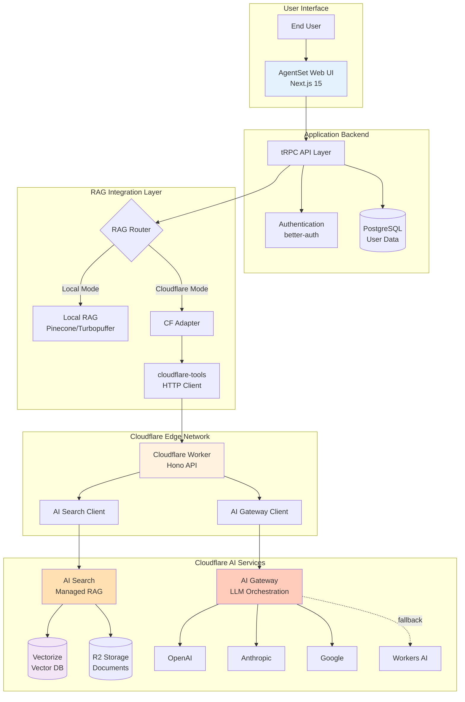
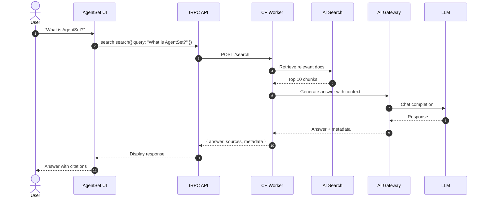
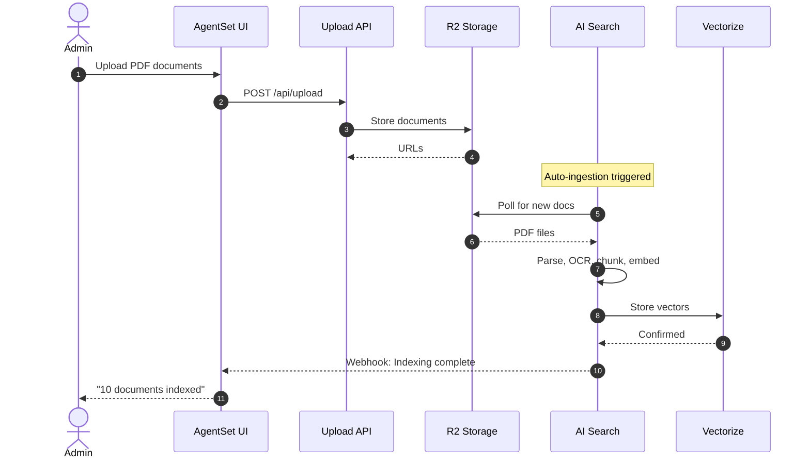

# AgentSet × Cloudflare Integration - Executive Summary

## Overview

This integration connects the **AgentSet UI** (Next.js application) with **Cloudflare's AI Search and AI Gateway** to provide a globally-distributed, edge-optimized RAG (Retrieval-Augmented Generation) platform.

## Visual Architecture Summary

### Complete System Architecture



## Key Components

### 1. AgentSet UI (Frontend)
**Repository:** `agentset/apps/web/`

- Next.js 15 application
- tRPC for type-safe APIs
- Workspace and namespace management
- Admin dashboard for Cloudflare configuration

### 2. Cloudflare Worker (Backend API)
**Repository:** `agentset-cloudflare-app/apps/cf-worker/`

- Hono-based REST API
- Deployed to Cloudflare's edge network (250+ locations)
- Orchestrates AI Search + AI Gateway
- Handles authentication, CORS, logging

### 3. Integration Package
**Location:** `agentset/packages/cloudflare-tools/`

- TypeScript client library
- Retry logic with exponential backoff
- Type-safe request/response handling
- Health check utilities

### 4. Cloudflare AI Search
- Automated document ingestion from R2
- OCR and parsing (PDF, DOCX, etc.)
- Chunking and embedding generation
- Vector search with tenant filtering

### 5. Cloudflare AI Gateway
- Multi-provider LLM routing
- Global caching (reduces cost & latency)
- Guardrails and safety controls
- Rate limiting and budget management

## Data Flow Examples

### Example 1: User Search Query



### Example 2: Document Upload & Indexing



## Operating Modes

The system supports three RAG modes:

### Mode 1: Local (Traditional)
```
User → AgentSet UI → tRPC → Local Vector Store (Pinecone/Turbopuffer)
```
- Uses existing AgentSet RAG engine
- Self-managed infrastructure
- Direct LLM API calls

### Mode 2: Cloudflare (Fully Managed)
```
User → AgentSet UI → tRPC → Cloudflare Worker → AI Search + AI Gateway
```
- Managed vector database (Vectorize)
- Automated ingestion and indexing
- Global edge caching
- Multi-provider fallback

### Mode 3: Hybrid (Best of Both)
```
User → AgentSet UI → tRPC → Router (decides per namespace)
                              ├─→ Local RAG (for some namespaces)
                              └─→ Cloudflare (for others)
```
- Per-namespace configuration
- Gradual migration path
- A/B testing capability

## Configuration Examples

### Namespace-Level Settings

```typescript
// Database schema (Prisma)
model Namespace {
  id String @id
  organizationId String  // Tenant isolation

  // Cloudflare Integration
  ragProvider     String?  // 'local' | 'cloudflare'
  cfModelRoute    String?  // 'final-answer' | 'fast-lane' | 'cheap'
  cfSafetyLevel   String?  // 'off' | 'standard' | 'strict'
  cfCacheMode     String?  // 'public' | 'private'
}
```

### Environment Variables

```bash
# AgentSet Application
RAG_MODE=hybrid                              # 'local' | 'cloudflare' | 'hybrid'
CF_SEARCH_ENDPOINT=https://...workers.dev   # Worker URL
CF_API_KEY=your-api-key                      # Authentication

# Cloudflare Worker
CLOUDFLARE_ACCOUNT_ID=...
AI_SEARCH_PROJECT_ID=...
AI_SEARCH_API_KEY=...
CF_GATEWAY_URL=https://gateway.ai.cloudflare.com/...
GATEWAY_TOKEN=...
```

## Key Features

### 1. Multi-Tenancy
- Organization-level isolation
- Workspace-scoped data
- Metadata filtering in vector search
- Per-namespace budget controls

### 2. Cost Optimization
- **Model Routes**: Choose quality vs. cost vs. speed
  - `final-answer`: Highest quality (GPT-4, Claude)
  - `fast-lane`: Low latency (GPT-4 Mini, Haiku)
  - `cheap`: Budget optimized (Workers AI, GPT-4 Mini)
- **Intelligent Caching**: Global edge cache reduces LLM calls
- **Auto-degradation**: Switch to cheaper models when budget limits hit

### 3. Performance
- **Edge Deployment**: Worker runs in 250+ locations
- **Cached Queries**: < 50ms latency
- **Uncached Queries**: < 2s latency
- **Auto-scaling**: Cloudflare handles all scaling

### 4. Reliability
- **Multi-provider fallback**: OpenAI → Anthropic → Workers AI
- **Local fallback**: Switch to local RAG if Cloudflare is down
- **Retry logic**: Exponential backoff with jitter
- **Circuit breakers**: Prevent cascade failures

### 5. Security
- **Session-based auth**: better-auth integration
- **API key validation**: Worker-level authentication
- **Tenant isolation**: Metadata filtering enforces boundaries
- **Encryption**: TLS in transit, encrypted storage

## Benefits Summary

| Aspect | Traditional Setup | With Cloudflare |
|--------|------------------|-----------------|
| **Infrastructure** | Self-managed vector DB | Fully managed Vectorize |
| **Scaling** | Manual provisioning | Auto-scaling at edge |
| **Global Performance** | Single region | 250+ edge locations |
| **Document Processing** | Custom pipelines | Automated AI Search ingestion |
| **LLM Access** | Direct API calls | Gateway with caching & fallback |
| **Cost Control** | Manual monitoring | Built-in budgets & degradation |
| **Latency** | Regional (100-500ms) | Global edge (< 50ms cached) |
| **Maintenance** | High (DB, embeddings) | Low (managed service) |

## Implementation Phases

### Phase 1: Foundation (Weeks 1-2)
✅ Copy agentset-tools package
✅ Create Cloudflare vector store adapter
✅ Modify search router with routing logic
✅ Configure environment variables

### Phase 2: Admin Controls (Week 3)
- Add Cloudflare settings to database schema
- Create admin UI for configuration
- Build metrics dashboard

### Phase 3: Migration & Testing (Week 4)
- Create migration scripts
- End-to-end integration tests
- Load testing and optimization

### Phase 4: Documentation & Deployment (Week 5)
- Complete documentation
- Deploy to staging
- Gradual production rollout

## Cost Projections

### Example: 100,000 queries/month

**Traditional Setup:**
- Vector DB hosting: $200/month
- LLM API calls: $300/month
- **Total: $500/month**

**With Cloudflare:**
- AI Search (vectorize + search): $100/month
- AI Gateway (cached): $100/month (60% cache hit rate)
- **Total: $200/month**

**Savings: 60%** + improved performance

## Success Metrics

### Performance Targets
- P95 latency < 150ms (cached)
- P95 latency < 2s (uncached)
- Cache hit rate > 40%
- 99.9% uptime

### Cost Targets
- 30% reduction in infrastructure costs
- Token usage reduction via caching
- Predictable monthly spend

### Quality Targets
- Citation accuracy >= existing system
- Search recall >= 90%
- User satisfaction maintained

## Next Steps

1. **Review Documentation**
   - [Architecture Guide](./architecture.md) - Deep dive into system design
   - [Integration Guide](./integration-guide.md) - Step-by-step implementation
   - [API Reference](./api-reference.md) - Complete API contracts

2. **Setup Cloudflare**
   - Create AI Search project
   - Configure AI Gateway
   - Set up model routes and guardrails

3. **Integrate Code**
   - Copy cloudflare-tools package
   - Create vector store adapter
   - Modify search router

4. **Test & Deploy**
   - Unit and integration tests
   - Deploy Worker to staging
   - Enable for test namespaces
   - Production rollout

## Support & Resources

- **Documentation**: `/docs/cloudflare-integration/`
- **GitHub Issues**: Track bugs and feature requests
- **Cloudflare Docs**: [AI Platform Documentation](https://developers.cloudflare.com/ai-gateway/)
- **AgentSet Docs**: [docs.agentset.ai](https://docs.agentset.ai)

---

**Last Updated:** October 26, 2025
**Version:** 1.0.0
**Status:** Ready for Implementation
