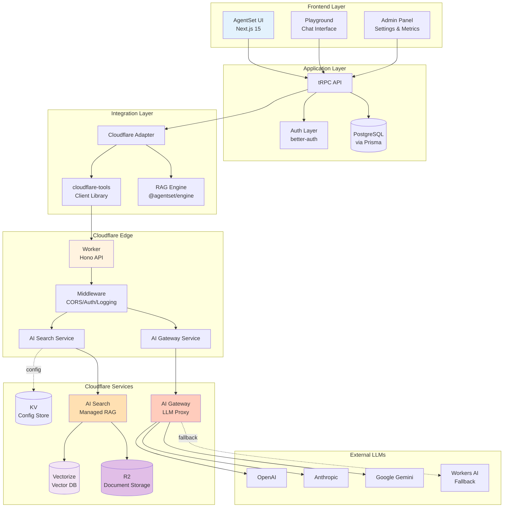
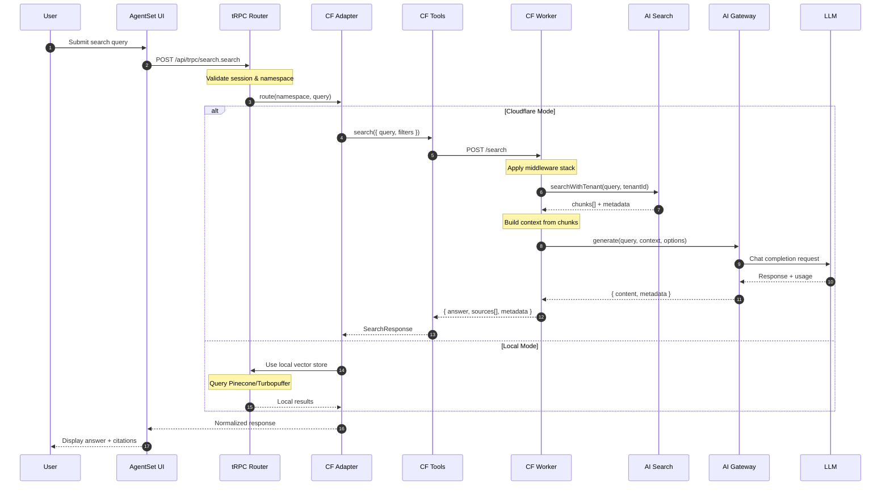
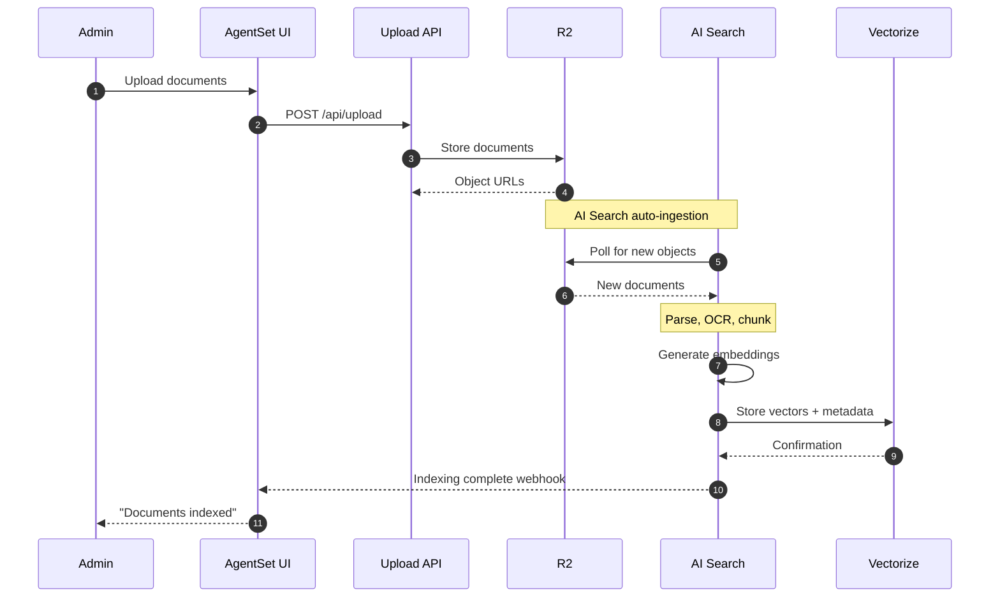
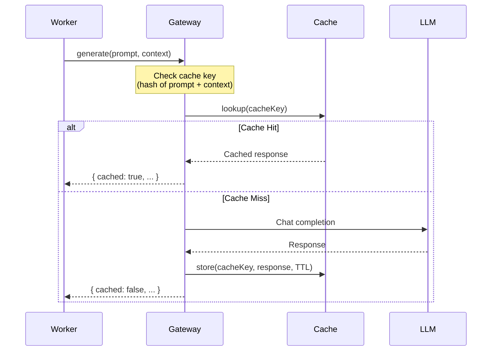
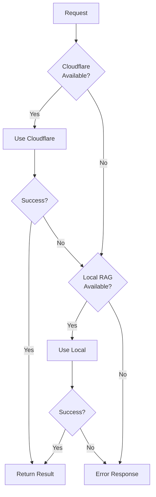
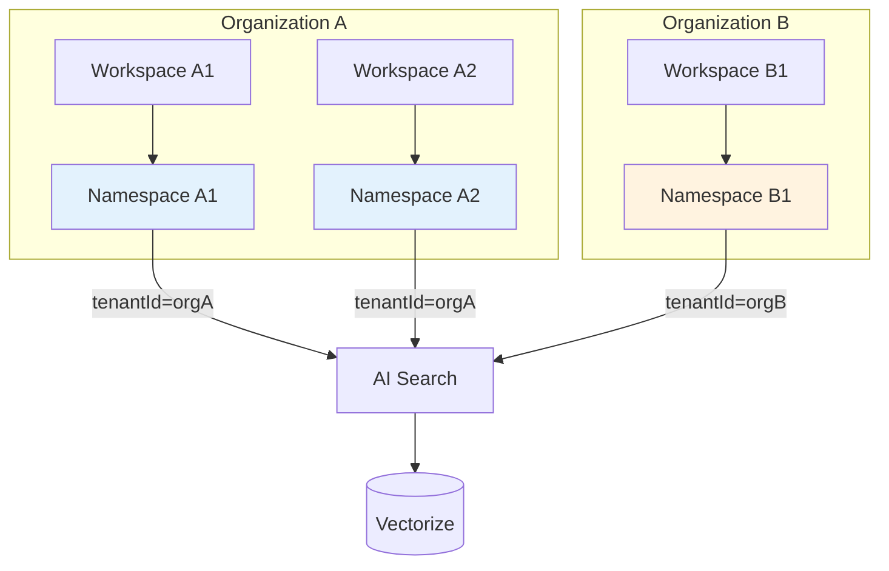
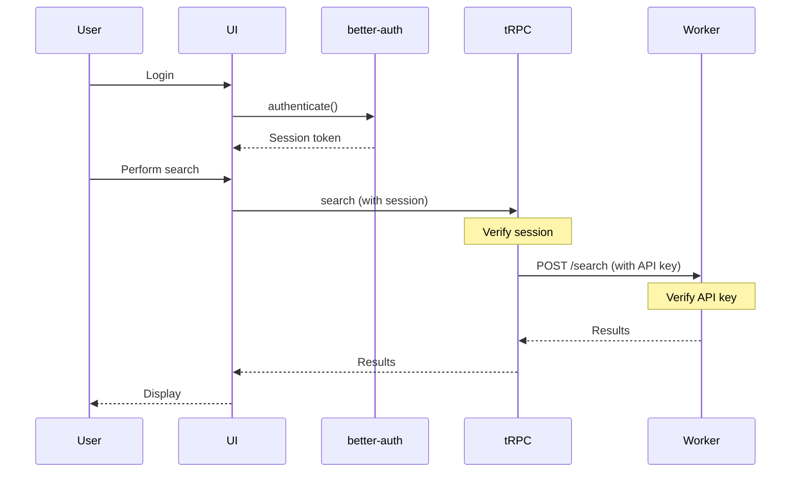
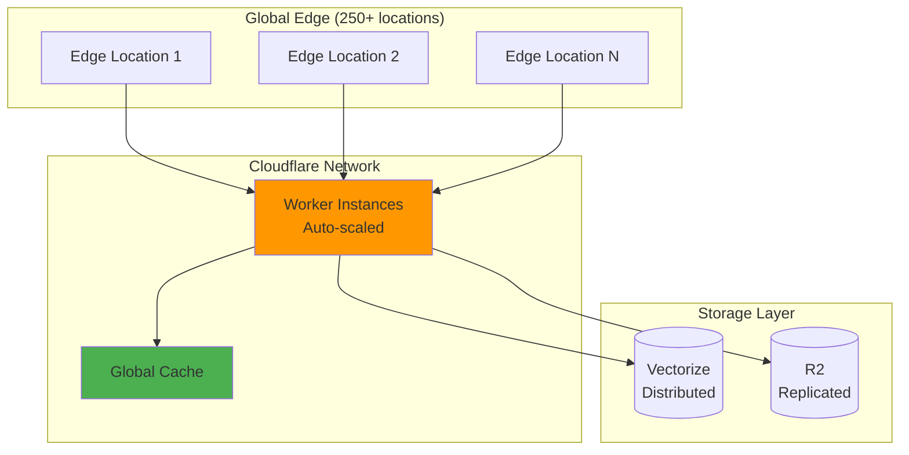
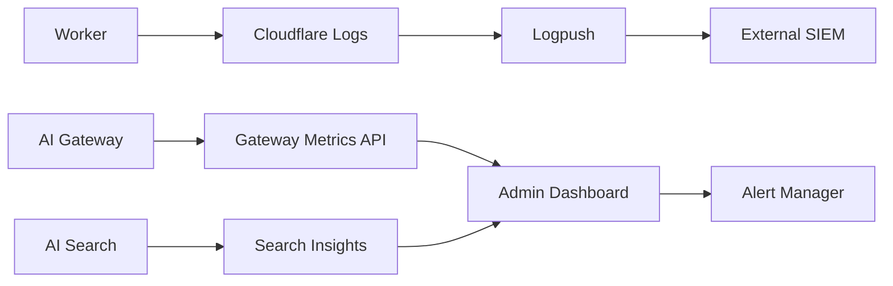

# Architecture Guide

## Table of Contents

1. [High-Level Overview](#high-level-overview)
2. [System Components](#system-components)
3. [Data Flow](#data-flow)
4. [Integration Patterns](#integration-patterns)
5. [Multi-Tenancy Architecture](#multi-tenancy-architecture)
6. [Security Architecture](#security-architecture)
7. [Scalability & Performance](#scalability--performance)

---

## High-Level Overview

The AgentSet × Cloudflare integration creates a hybrid RAG (Retrieval-Augmented Generation) platform that combines:

- **AgentSet's** proven UI/UX and workspace management
- **Cloudflare's** managed AI services for edge-optimized RAG

### Why This Architecture?

| Traditional AgentSet | With Cloudflare Integration |
|---------------------|----------------------------|
| Self-managed vector databases | Managed Vectorize service |
| Manual embedding pipelines | Automated AI Search ingestion |
| Direct LLM API calls | AI Gateway with caching & fallback |
| Regional infrastructure | Global edge network |
| Complex scaling | Auto-scaling at edge |

---

## System Components

### Component Diagram



### Component Responsibilities

#### Frontend Layer

**AgentSet UI** (`agentset/apps/web/`)
- User interface for all RAG interactions
- Workspace and namespace management
- User authentication and authorization
- Real-time chat and search interfaces

**Admin Panel**
- Cloudflare-specific configuration
- Metrics dashboard (usage, cost, latency)
- Model route selection
- Safety and caching controls

#### Application Layer

**tRPC API** (`src/server/api/`)
- Type-safe API layer
- Request validation
- Business logic orchestration
- Database operations

**Database** (PostgreSQL via Prisma)
- User accounts and organizations
- Namespaces and workspaces
- Configuration storage
- Usage tracking

#### Integration Layer

**Cloudflare Adapter** (`src/lib/cloudflare/adapter.ts`)
- Routes requests to Cloudflare or local RAG
- Handles mode switching (local/cloudflare/hybrid)
- Response format normalization
- Error handling and fallback logic

**cloudflare-tools Package** (`packages/cloudflare-tools/`)
- HTTP client for Worker communication
- Retry logic with exponential backoff
- Request/response typing
- Health check utilities

**RAG Engine** (`packages/engine/`)
- Abstract vector store interface
- Cloudflare vector store implementation
- Embedding model management
- Query processing

#### Cloudflare Edge Layer

**Cloudflare Worker** (`agentset-cloudflare-app/apps/cf-worker/`)
- Edge API endpoint (Hono-based)
- Request orchestration
- AI Search integration
- AI Gateway integration

**Middleware Stack**
- CORS handling
- Authentication/authorization
- Error handling
- Request/response logging

**Services**
- `aiSearch.ts` - AI Search client
- `aiGateway.ts` - AI Gateway client
- Utility functions (retry, validation)

#### Cloudflare Services

**AI Search**
- Automated document ingestion from R2
- OCR and parsing
- Chunking and embedding
- Vector search with filters

**AI Gateway**
- Multi-provider LLM routing
- Request caching
- Rate limiting
- Cost tracking
- Guardrails and safety

**Vectorize**
- Vector database for embeddings
- Similarity search
- Metadata filtering

**R2**
- Document storage
- Source file retention
- Ingestion pipeline source

**KV**
- Workspace configuration
- Feature flags
- Rate limit state

---

## Data Flow

### Search Query Flow



### Document Ingestion Flow



### Caching Flow



---

## Integration Patterns

### 1. Dual-Mode Routing Pattern

The system supports three routing modes:

```typescript
type RAGMode = 'local' | 'cloudflare' | 'hybrid';

// Per-namespace configuration
interface NamespaceSettings {
  ragProvider?: 'local' | 'cloudflare';
  // ... other settings
}

// Routing logic
async function routeSearch(namespace: Namespace, query: string) {
  const mode = process.env.RAG_MODE as RAGMode;

  if (mode === 'cloudflare') {
    return await cloudflareSearch(namespace, query);
  }

  if (mode === 'local') {
    return await localSearch(namespace, query);
  }

  // Hybrid: check namespace preference
  if (namespace.settings?.ragProvider === 'cloudflare') {
    return await cloudflareSearch(namespace, query);
  }

  return await localSearch(namespace, query);
}
```

### 2. Adapter Pattern

The Cloudflare adapter normalizes responses between local and cloud RAG:

```typescript
interface UnifiedSearchResult {
  answer: string;
  sources: Source[];
  metadata: {
    model: string;
    tokens: number;
    cached: boolean;
    latency: number;
  };
}

class CloudflareAdapter {
  async search(params: SearchParams): Promise<UnifiedSearchResult> {
    const response = await this.client.search({
      query: params.query,
      workspaceId: params.namespaceId,
      // ... map parameters
    });

    // Normalize to unified format
    return this.normalizeResponse(response);
  }
}
```

### 3. Fallback Pattern

Multiple fallback layers ensure high availability:



Implementation:

```typescript
async function searchWithFallback(params: SearchParams) {
  try {
    // Try Cloudflare first
    return await cloudflareSearch(params);
  } catch (error) {
    console.warn('Cloudflare search failed, falling back to local', error);

    if (process.env.ENABLE_LOCAL_FALLBACK === 'true') {
      return await localSearch(params);
    }

    throw error;
  }
}
```

---

## Multi-Tenancy Architecture

### Tenant Isolation



### Isolation Mechanisms

1. **Metadata Filtering**
```typescript
// AI Search query with tenant filter
const results = await searchClient.searchWithTenant(
  query,
  tenantId,  // Ensures only this tenant's docs
  workspaceId,
  options
);
```

2. **Namespace-Scoped Configuration**
```prisma
model Namespace {
  id              String  @id
  organizationId  String  // Tenant identifier

  // Each namespace has isolated settings
  cfSettings      Json?
  cfModelRoute    String?
  cfSafetyLevel   String?
}
```

3. **API Key Scoping**
```typescript
// Worker validates requests are scoped to authorized tenant
async function authMiddleware(c: Context) {
  const tenantId = extractTenantId(c.req);
  const apiKey = c.req.header('Authorization');

  if (!isAuthorizedForTenant(apiKey, tenantId)) {
    return c.json({ error: 'Unauthorized' }, 401);
  }

  // Store tenantId for downstream use
  c.set('tenantId', tenantId);
}
```

---

## Security Architecture

### Authentication Flow



### Security Layers

1. **User Authentication** (better-auth)
   - Session-based authentication
   - OAuth integration
   - MFA support

2. **API Authentication** (Worker)
   - Bearer token validation
   - API key scoping to tenants
   - Rate limiting per key

3. **Data Encryption**
   - TLS in transit
   - Encrypted storage in R2
   - Database encryption at rest

4. **Access Control**
   - Role-based permissions (RBAC)
   - Namespace-level isolation
   - Admin action auditing

---

## Scalability & Performance

### Performance Characteristics

| Operation | Latency Target | Strategy |
|-----------|---------------|----------|
| Cached query | < 50ms | Edge caching via AI Gateway |
| Uncached query | < 2s | Worker edge execution |
| Document upload | < 500ms | Async R2 upload |
| Document indexing | Background | AI Search auto-ingestion |

### Scaling Architecture



### Optimization Strategies

1. **Edge Caching**
   - Global cache for identical prompts
   - Configurable TTL by mode (public/private)
   - Cache warming for common queries

2. **Model Route Optimization**
   - `cheap` route for high-volume, low-stakes queries
   - `fast-lane` route for real-time interactions
   - `final-answer` route for critical accuracy

3. **Request Batching**
   - Batch multiple namespace queries
   - Parallel AI Search lookups
   - Concurrent LLM calls

4. **Auto-Degradation**
   - Budget-based route switching (final-answer → cheap)
   - Graceful fallback to local RAG
   - Circuit breaker for failing providers

---

## Monitoring & Observability

### Metrics Collection



### Key Metrics

- **Request Metrics**: QPS, latency (p50/p95/p99), error rate
- **Cost Metrics**: Token usage, model costs, budget consumption
- **Cache Metrics**: Hit rate, eviction rate, TTL distribution
- **Quality Metrics**: Citation accuracy, search recall, user feedback

---

## Conclusion

This architecture provides:

✅ **Scalability** - Global edge network with auto-scaling
✅ **Reliability** - Multiple fallback layers and circuit breakers
✅ **Performance** - Edge caching and optimized routing
✅ **Security** - Multi-layered authentication and tenant isolation
✅ **Cost Efficiency** - Intelligent caching and model route selection
✅ **Flexibility** - Support for local, cloud, and hybrid modes

Next: [Integration Guide](./integration-guide.md)
