# Frontend Integration Plan

## Table of Contents

1. [Overview](#overview)
2. [UI Components to Modify](#ui-components-to-modify)
3. [New UI Components to Create](#new-ui-components-to-create)
4. [Settings UI Implementation](#settings-ui-implementation)
5. [Dashboard & Metrics UI](#dashboard--metrics-ui)
6. [User Experience Flow](#user-experience-flow)
7. [Implementation Checklist](#implementation-checklist)

---

## Overview

This document outlines the frontend changes needed to integrate AgentSet UI with Cloudflare AI Search and AI Gateway. The goal is to provide administrators and users with controls to leverage Cloudflare's capabilities while maintaining the existing AgentSet UX.

### Design Principles

1. **Progressive Enhancement** - Cloudflare features are optional enhancements
2. **Backward Compatibility** - Existing local RAG continues to work
3. **Per-Namespace Control** - Admins can choose RAG provider per namespace
4. **Transparency** - Users see which system is powering their queries
5. **Performance Visibility** - Show caching, latency, and cost metrics

---

## UI Components to Modify

### 1. Namespace Settings Page

**Location:** `agentset/apps/web/src/app/app.agentset.ai/(dashboard)/[slug]/[namespaceSlug]/settings/page.tsx`

#### Current State
```typescript
// Existing settings: embeddings, vector store, chunking
interface NamespaceSettings {
  embeddingModel: string;
  vectorStore: 'pinecone' | 'turbopuffer';
  chunkSize: number;
  chunkOverlap: number;
}
```

#### Modifications Needed
Add a new "RAG Provider" section:

```typescript
interface NamespaceSettings {
  // Existing fields
  embeddingModel: string;
  vectorStore: 'pinecone' | 'turbopuffer';

  // NEW: Cloudflare Integration
  ragProvider: 'local' | 'cloudflare';
  cfModelRoute?: 'final-answer' | 'fast-lane' | 'cheap';
  cfSafetyLevel?: 'off' | 'standard' | 'strict';
  cfCacheMode?: 'public' | 'private';
  cfBudgetLimit?: number;  // Monthly budget in USD
}
```

#### UI Mockup

```
┌─────────────────────────────────────────────────────────┐
│  Namespace Settings                                     │
├─────────────────────────────────────────────────────────┤
│                                                         │
│  RAG Provider                                           │
│  ┌─────────────────────────────────────────────┐       │
│  │ ● Local (Pinecone/Turbopuffer)              │       │
│  │ ○ Cloudflare AI Search                      │       │
│  └─────────────────────────────────────────────┘       │
│                                                         │
│  [When Cloudflare selected, show:]                     │
│                                                         │
│  ┌───────────── Cloudflare Configuration ─────────────┐│
│  │                                                     ││
│  │  Model Route                                       ││
│  │  ┌─────────────────────────────────────┐           ││
│  │  │ Final Answer ▼                       │           ││
│  │  └─────────────────────────────────────┘           ││
│  │  • Final Answer: Highest quality                  ││
│  │  • Fast Lane: Low latency                         ││
│  │  • Cheap: Budget optimized                        ││
│  │                                                     ││
│  │  Safety Level                                      ││
│  │  ┌─────────────────────────────────────┐           ││
│  │  │ Standard ▼                           │           ││
│  │  └─────────────────────────────────────┘           ││
│  │                                                     ││
│  │  Cache Mode                                        ││
│  │  ┌─────────────────────────────────────┐           ││
│  │  │ Public (Global Cache) ▼              │           ││
│  │  └─────────────────────────────────────┘           ││
│  │                                                     ││
│  │  Monthly Budget Limit                              ││
│  │  ┌─────────────────────────────────────┐           ││
│  │  │ $100 USD                             │           ││
│  │  └─────────────────────────────────────┘           ││
│  │                                                     ││
│  └─────────────────────────────────────────────────────┘│
│                                                         │
│  [ Save Settings ]                                      │
└─────────────────────────────────────────────────────────┘
```

### 2. Playground/Chat Interface

**Location:** `agentset/apps/web/src/app/app.agentset.ai/(dashboard)/[slug]/[namespaceSlug]/playground/`

#### Modifications Needed

Add visual indicators showing:
- Which RAG provider is active
- Cache hit/miss status
- Response latency
- Token usage and cost

#### UI Enhancement

```
┌─────────────────────────────────────────────────────────┐
│  Playground                                    [⚙️]     │
├─────────────────────────────────────────────────────────┤
│                                                         │
│  Query: "What is AgentSet?"                             │
│                                                         │
│  ┌─────────────────────────────────────────────────┐   │
│  │  AgentSet is an open-source RAG platform...    │   │
│  │                                                 │   │
│  │  [View 3 Citations]                            │   │
│  └─────────────────────────────────────────────────┘   │
│                                                         │
│  ┌───────────── Query Metadata ──────────────┐         │
│  │ Provider: Cloudflare AI Search             │         │
│  │ Model: claude-3-5-sonnet (via final-answer)│         │
│  │ ⚡ Cached: Yes (48ms)                       │         │
│  │ 💰 Cost: $0.0001 (65 tokens)               │         │
│  └────────────────────────────────────────────┘         │
│                                                         │
└─────────────────────────────────────────────────────────┘
```

#### Component Code

```tsx
// QueryMetadata.tsx
interface QueryMetadataProps {
  metadata: {
    provider: 'local' | 'cloudflare';
    model: string;
    cached: boolean;
    latency: number;
    tokens: number;
    cost: number;
  };
}

export function QueryMetadata({ metadata }: QueryMetadataProps) {
  return (
    <Card className="mt-4 p-4 bg-muted/50">
      <div className="grid grid-cols-2 gap-4 text-sm">
        <div>
          <Label className="text-muted-foreground">Provider</Label>
          <p className="font-medium">
            {metadata.provider === 'cloudflare' ? (
              <>
                <CloudIcon className="inline w-4 h-4 mr-1" />
                Cloudflare AI Search
              </>
            ) : (
              <>
                <DatabaseIcon className="inline w-4 h-4 mr-1" />
                Local RAG
              </>
            )}
          </p>
        </div>

        <div>
          <Label className="text-muted-foreground">Model</Label>
          <p className="font-medium">{metadata.model}</p>
        </div>

        <div>
          <Label className="text-muted-foreground">Performance</Label>
          <p className="font-medium">
            {metadata.cached && (
              <Badge variant="success" className="mr-2">
                ⚡ Cached
              </Badge>
            )}
            {metadata.latency}ms
          </p>
        </div>

        <div>
          <Label className="text-muted-foreground">Cost</Label>
          <p className="font-medium">
            ${metadata.cost.toFixed(4)} ({metadata.tokens} tokens)
          </p>
        </div>
      </div>
    </Card>
  );
}
```

---

## New UI Components to Create

### 1. Cloudflare Settings Page

**Location:** `agentset/apps/web/src/app/app.agentset.ai/(dashboard)/[slug]/[namespaceSlug]/cloudflare/page.tsx`

A dedicated page for advanced Cloudflare configuration.

```tsx
'use client';

import { useState } from 'react';
import { Card } from '@agentset/ui/card';
import { Button } from '@agentset/ui/button';
import { Label } from '@agentset/ui/label';
import { Select } from '@agentset/ui/select';
import { Input } from '@agentset/ui/input';
import { Switch } from '@agentset/ui/switch';
import { Tabs, TabsContent, TabsList, TabsTrigger } from '@agentset/ui/tabs';
import { api } from '@/trpc/react';

export default function CloudflarePage({ params }: { params: { slug: string; namespaceSlug: string } }) {
  const { data: namespace } = api.namespace.get.useQuery({ slug: params.namespaceSlug });
  const updateSettings = api.namespace.updateCloudflareSettings.useMutation();

  return (
    <div className="space-y-6">
      <div>
        <h1 className="text-3xl font-bold">Cloudflare Configuration</h1>
        <p className="text-muted-foreground">
          Advanced settings for AI Search and AI Gateway integration
        </p>
      </div>

      <Tabs defaultValue="general">
        <TabsList>
          <TabsTrigger value="general">General</TabsTrigger>
          <TabsTrigger value="models">Model Routes</TabsTrigger>
          <TabsTrigger value="safety">Safety & Guardrails</TabsTrigger>
          <TabsTrigger value="caching">Caching</TabsTrigger>
          <TabsTrigger value="budget">Budget & Limits</TabsTrigger>
        </TabsList>

        <TabsContent value="general" className="space-y-4">
          <Card className="p-6">
            <h3 className="text-lg font-semibold mb-4">RAG Provider</h3>

            <div className="space-y-4">
              <div>
                <Label>Active Provider</Label>
                <Select value={namespace?.ragProvider} onChange={(e) => {/* update */}}>
                  <option value="local">Local (Pinecone/Turbopuffer)</option>
                  <option value="cloudflare">Cloudflare AI Search</option>
                </Select>
              </div>

              {namespace?.ragProvider === 'cloudflare' && (
                <>
                  <div>
                    <Label>Worker Endpoint</Label>
                    <Input value={process.env.NEXT_PUBLIC_CF_SEARCH_ENDPOINT} disabled />
                    <p className="text-sm text-muted-foreground mt-1">
                      Configured globally in environment variables
                    </p>
                  </div>

                  <div>
                    <Label>Connection Status</Label>
                    <div className="flex items-center gap-2">
                      <Badge variant="success">● Connected</Badge>
                      <span className="text-sm text-muted-foreground">
                        Last checked: 2 minutes ago
                      </span>
                    </div>
                  </div>
                </>
              )}
            </div>
          </Card>
        </TabsContent>

        <TabsContent value="models" className="space-y-4">
          <Card className="p-6">
            <h3 className="text-lg font-semibold mb-4">Model Route Selection</h3>

            <div className="space-y-4">
              <div>
                <Label>Default Route</Label>
                <Select value={namespace?.cfModelRoute}>
                  <option value="final-answer">Final Answer (Highest Quality)</option>
                  <option value="fast-lane">Fast Lane (Low Latency)</option>
                  <option value="cheap">Cheap (Budget Optimized)</option>
                </Select>
              </div>

              {/* Route Details Table */}
              <div className="border rounded-lg">
                <table className="w-full">
                  <thead>
                    <tr className="border-b bg-muted/50">
                      <th className="p-3 text-left">Route</th>
                      <th className="p-3 text-left">Primary Model</th>
                      <th className="p-3 text-left">Avg Latency</th>
                      <th className="p-3 text-left">Avg Cost</th>
                    </tr>
                  </thead>
                  <tbody>
                    <tr className="border-b">
                      <td className="p-3">Final Answer</td>
                      <td className="p-3">Claude 3.5 Sonnet</td>
                      <td className="p-3">~1.2s</td>
                      <td className="p-3">$0.003/query</td>
                    </tr>
                    <tr className="border-b">
                      <td className="p-3">Fast Lane</td>
                      <td className="p-3">GPT-4o Mini</td>
                      <td className="p-3">~0.6s</td>
                      <td className="p-3">$0.0005/query</td>
                    </tr>
                    <tr>
                      <td className="p-3">Cheap</td>
                      <td className="p-3">Workers AI</td>
                      <td className="p-3">~0.4s</td>
                      <td className="p-3">$0.0001/query</td>
                    </tr>
                  </tbody>
                </table>
              </div>
            </div>
          </Card>
        </TabsContent>

        <TabsContent value="safety" className="space-y-4">
          <Card className="p-6">
            <h3 className="text-lg font-semibold mb-4">Safety & Guardrails</h3>

            <div className="space-y-4">
              <div>
                <Label>Safety Level</Label>
                <Select value={namespace?.cfSafetyLevel}>
                  <option value="off">Off (No Guardrails)</option>
                  <option value="standard">Standard (Recommended)</option>
                  <option value="strict">Strict (Maximum Protection)</option>
                </Select>
              </div>

              {namespace?.cfSafetyLevel !== 'off' && (
                <div className="space-y-2 p-4 bg-muted rounded-lg">
                  <h4 className="font-medium">Active Guardrails</h4>
                  <ul className="space-y-1 text-sm">
                    <li>✓ Content filtering</li>
                    <li>✓ PII detection {namespace?.cfSafetyLevel === 'strict' && '+ redaction'}</li>
                    {namespace?.cfSafetyLevel === 'strict' && (
                      <li>✓ Prompt injection detection</li>
                    )}
                  </ul>
                </div>
              )}
            </div>
          </Card>
        </TabsContent>

        <TabsContent value="caching" className="space-y-4">
          <Card className="p-6">
            <h3 className="text-lg font-semibold mb-4">Caching Configuration</h3>

            <div className="space-y-4">
              <div>
                <Label>Cache Mode</Label>
                <Select value={namespace?.cfCacheMode}>
                  <option value="public">Public (Global Cache)</option>
                  <option value="private">Private (No Cache)</option>
                </Select>
                <p className="text-sm text-muted-foreground mt-1">
                  Public mode caches responses globally, reducing latency and cost
                </p>
              </div>

              {namespace?.cfCacheMode === 'public' && (
                <div className="p-4 bg-muted rounded-lg">
                  <h4 className="font-medium mb-2">Cache Statistics (Last 7 days)</h4>
                  <div className="grid grid-cols-3 gap-4 text-sm">
                    <div>
                      <p className="text-muted-foreground">Hit Rate</p>
                      <p className="text-2xl font-bold">42%</p>
                    </div>
                    <div>
                      <p className="text-muted-foreground">Avg Latency (cached)</p>
                      <p className="text-2xl font-bold">48ms</p>
                    </div>
                    <div>
                      <p className="text-muted-foreground">Cost Savings</p>
                      <p className="text-2xl font-bold">$12.50</p>
                    </div>
                  </div>
                </div>
              )}
            </div>
          </Card>
        </TabsContent>

        <TabsContent value="budget" className="space-y-4">
          <Card className="p-6">
            <h3 className="text-lg font-semibold mb-4">Budget & Limits</h3>

            <div className="space-y-4">
              <div>
                <Label>Monthly Budget Limit</Label>
                <div className="flex gap-2">
                  <Input
                    type="number"
                    value={namespace?.cfBudgetLimit || 100}
                    placeholder="100"
                  />
                  <span className="flex items-center px-3 border rounded-md bg-muted">
                    USD
                  </span>
                </div>
                <p className="text-sm text-muted-foreground mt-1">
                  When budget is reached, queries will auto-degrade to cheaper route
                </p>
              </div>

              <div>
                <Label>Current Month Usage</Label>
                <div className="space-y-2">
                  <div className="flex justify-between text-sm">
                    <span>$23.50 / $100.00</span>
                    <span className="text-muted-foreground">23.5%</span>
                  </div>
                  <div className="w-full bg-muted rounded-full h-2">
                    <div className="bg-primary h-2 rounded-full" style={{ width: '23.5%' }} />
                  </div>
                </div>
              </div>

              <div className="flex items-center justify-between p-4 border rounded-lg">
                <div>
                  <p className="font-medium">Auto-degradation</p>
                  <p className="text-sm text-muted-foreground">
                    Automatically switch to cheaper model route when budget limit is approached
                  </p>
                </div>
                <Switch defaultChecked />
              </div>
            </div>
          </Card>
        </TabsContent>
      </Tabs>

      <div className="flex justify-end gap-2">
        <Button variant="outline">Reset to Defaults</Button>
        <Button onClick={() => updateSettings.mutate()}>
          Save Changes
        </Button>
      </div>
    </div>
  );
}
```

### 2. Metrics Dashboard

**Location:** `agentset/apps/web/src/app/app.agentset.ai/(dashboard)/[slug]/[namespaceSlug]/metrics/page.tsx`

```tsx
'use client';

import { Card } from '@agentset/ui/card';
import { Tabs, TabsContent, TabsList, TabsTrigger } from '@agentset/ui/tabs';
import { api } from '@/trpc/react';

export default function MetricsPage({ params }: { params: { slug: string; namespaceSlug: string } }) {
  const { data: metrics } = api.cloudflare.getMetrics.useQuery({
    namespaceId: params.namespaceSlug,
    timeRange: '7d',
  });

  return (
    <div className="space-y-6">
      <div>
        <h1 className="text-3xl font-bold">Cloudflare Metrics</h1>
        <p className="text-muted-foreground">
          Performance, cost, and usage analytics
        </p>
      </div>

      {/* KPI Cards */}
      <div className="grid grid-cols-1 md:grid-cols-2 lg:grid-cols-4 gap-4">
        <Card className="p-6">
          <p className="text-sm text-muted-foreground">Total Queries</p>
          <p className="text-3xl font-bold">{metrics?.totalQueries?.toLocaleString()}</p>
          <p className="text-sm text-green-600">+12% from last week</p>
        </Card>

        <Card className="p-6">
          <p className="text-sm text-muted-foreground">Avg Latency</p>
          <p className="text-3xl font-bold">{metrics?.avgLatency}ms</p>
          <p className="text-sm text-green-600">-23ms improvement</p>
        </Card>

        <Card className="p-6">
          <p className="text-sm text-muted-foreground">Cache Hit Rate</p>
          <p className="text-3xl font-bold">{metrics?.cacheHitRate}%</p>
          <p className="text-sm text-muted-foreground">Global edge cache</p>
        </Card>

        <Card className="p-6">
          <p className="text-sm text-muted-foreground">Total Cost</p>
          <p className="text-3xl font-bold">${metrics?.totalCost?.toFixed(2)}</p>
          <p className="text-sm text-green-600">$8.50 saved via cache</p>
        </Card>
      </div>

      <Tabs defaultValue="performance">
        <TabsList>
          <TabsTrigger value="performance">Performance</TabsTrigger>
          <TabsTrigger value="cost">Cost Analysis</TabsTrigger>
          <TabsTrigger value="models">Model Usage</TabsTrigger>
          <TabsTrigger value="errors">Errors & Logs</TabsTrigger>
        </TabsList>

        <TabsContent value="performance" className="space-y-4">
          <Card className="p-6">
            <h3 className="text-lg font-semibold mb-4">Latency Distribution</h3>
            {/* Chart showing P50, P95, P99 latencies over time */}
            <div className="h-64 bg-muted/30 rounded flex items-center justify-center">
              [Latency Chart - integrate with recharts or similar]
            </div>
          </Card>

          <Card className="p-6">
            <h3 className="text-lg font-semibold mb-4">Cache Performance</h3>
            <div className="h-64 bg-muted/30 rounded flex items-center justify-center">
              [Cache Hit/Miss Chart]
            </div>
          </Card>
        </TabsContent>

        <TabsContent value="cost" className="space-y-4">
          <Card className="p-6">
            <h3 className="text-lg font-semibold mb-4">Cost Breakdown</h3>
            <div className="space-y-2">
              <div className="flex justify-between p-2 border-b">
                <span>LLM API Calls</span>
                <span className="font-medium">${metrics?.costs?.llm.toFixed(2)}</span>
              </div>
              <div className="flex justify-between p-2 border-b">
                <span>AI Search (Vectorize)</span>
                <span className="font-medium">${metrics?.costs?.search.toFixed(2)}</span>
              </div>
              <div className="flex justify-between p-2 border-b">
                <span>Worker Execution</span>
                <span className="font-medium">${metrics?.costs?.worker.toFixed(2)}</span>
              </div>
              <div className="flex justify-between p-2 font-bold">
                <span>Total</span>
                <span>${metrics?.totalCost?.toFixed(2)}</span>
              </div>
            </div>
          </Card>
        </TabsContent>

        <TabsContent value="models" className="space-y-4">
          <Card className="p-6">
            <h3 className="text-lg font-semibold mb-4">Model Route Usage</h3>
            <div className="space-y-4">
              {metrics?.modelUsage?.map((model) => (
                <div key={model.route}>
                  <div className="flex justify-between mb-1">
                    <span className="font-medium">{model.route}</span>
                    <span className="text-sm text-muted-foreground">
                      {model.count} queries ({model.percentage}%)
                    </span>
                  </div>
                  <div className="w-full bg-muted rounded-full h-2">
                    <div
                      className="bg-primary h-2 rounded-full"
                      style={{ width: `${model.percentage}%` }}
                    />
                  </div>
                </div>
              ))}
            </div>
          </Card>
        </TabsContent>

        <TabsContent value="errors" className="space-y-4">
          <Card className="p-6">
            <h3 className="text-lg font-semibold mb-4">Recent Errors</h3>
            {/* Error log table */}
            <div className="space-y-2">
              {metrics?.errors?.map((error, i) => (
                <div key={i} className="p-3 border rounded-lg">
                  <div className="flex justify-between">
                    <span className="font-medium text-red-600">{error.type}</span>
                    <span className="text-sm text-muted-foreground">{error.timestamp}</span>
                  </div>
                  <p className="text-sm mt-1">{error.message}</p>
                </div>
              ))}
            </div>
          </Card>
        </TabsContent>
      </Tabs>
    </div>
  );
}
```

---

## Settings UI Implementation

### Database Schema Updates

```prisma
// packages/db/prisma/schema.prisma

model Namespace {
  id              String   @id @default(cuid())
  slug            String
  name            String
  organizationId  String

  // Existing fields
  embeddingModel  String?
  vectorStore     String?
  chunkSize       Int?
  chunkOverlap    Int?

  // NEW: Cloudflare Integration
  ragProvider     String?  @default("local")  // 'local' | 'cloudflare'
  cfModelRoute    String?  @default("final-answer")  // 'final-answer' | 'fast-lane' | 'cheap'
  cfSafetyLevel   String?  @default("standard")  // 'off' | 'standard' | 'strict'
  cfCacheMode     String?  @default("public")  // 'public' | 'private'
  cfBudgetLimit   Float?   @default(100.0)  // USD per month
  cfSettings      Json?    // Additional CF-specific settings

  // ... other fields
}

// NEW: Track Cloudflare usage metrics
model CloudflareMetric {
  id            String   @id @default(cuid())
  namespaceId   String
  timestamp     DateTime @default(now())

  queryCount    Int
  totalLatency  Int      // milliseconds
  cacheHits     Int
  cacheMisses   Int
  totalCost     Float    // USD
  modelRoute    String
  modelName     String
  tokenCount    Int

  namespace     Namespace @relation(fields: [namespaceId], references: [id], onDelete: Cascade)

  @@index([namespaceId, timestamp])
}
```

### tRPC API Extensions

```typescript
// apps/web/src/server/api/routers/cloudflare.ts

import { createTRPCRouter, protectedProcedure } from '@/server/api/trpc';
import { z } from 'zod/v4';

export const cloudflareRouter = createTRPCRouter({
  // Get Cloudflare settings for namespace
  getSettings: protectedProcedure
    .input(z.object({ namespaceId: z.string() }))
    .query(async ({ ctx, input }) => {
      const namespace = await ctx.db.namespace.findUnique({
        where: { id: input.namespaceId },
        select: {
          ragProvider: true,
          cfModelRoute: true,
          cfSafetyLevel: true,
          cfCacheMode: true,
          cfBudgetLimit: true,
          cfSettings: true,
        },
      });
      return namespace;
    }),

  // Update Cloudflare settings
  updateSettings: protectedProcedure
    .input(
      z.object({
        namespaceId: z.string(),
        ragProvider: z.enum(['local', 'cloudflare']).optional(),
        cfModelRoute: z.enum(['final-answer', 'fast-lane', 'cheap']).optional(),
        cfSafetyLevel: z.enum(['off', 'standard', 'strict']).optional(),
        cfCacheMode: z.enum(['public', 'private']).optional(),
        cfBudgetLimit: z.number().optional(),
      })
    )
    .mutation(async ({ ctx, input }) => {
      const { namespaceId, ...settings } = input;
      return await ctx.db.namespace.update({
        where: { id: namespaceId },
        data: settings,
      });
    }),

  // Get metrics
  getMetrics: protectedProcedure
    .input(
      z.object({
        namespaceId: z.string(),
        timeRange: z.enum(['1h', '24h', '7d', '30d']),
      })
    )
    .query(async ({ ctx, input }) => {
      const startDate = getStartDate(input.timeRange);

      const metrics = await ctx.db.cloudflareMetric.findMany({
        where: {
          namespaceId: input.namespaceId,
          timestamp: { gte: startDate },
        },
        orderBy: { timestamp: 'desc' },
      });

      // Aggregate metrics
      return {
        totalQueries: metrics.reduce((sum, m) => sum + m.queryCount, 0),
        avgLatency: Math.round(
          metrics.reduce((sum, m) => sum + m.totalLatency, 0) / metrics.length
        ),
        cacheHitRate: Math.round(
          (metrics.reduce((sum, m) => sum + m.cacheHits, 0) /
            (metrics.reduce((sum, m) => sum + m.cacheHits + m.cacheMisses, 0))) *
            100
        ),
        totalCost: metrics.reduce((sum, m) => sum + m.totalCost, 0),
        // ... more aggregations
      };
    }),
});

function getStartDate(range: string): Date {
  const now = new Date();
  switch (range) {
    case '1h': return new Date(now.getTime() - 60 * 60 * 1000);
    case '24h': return new Date(now.getTime() - 24 * 60 * 60 * 1000);
    case '7d': return new Date(now.getTime() - 7 * 24 * 60 * 60 * 1000);
    case '30d': return new Date(now.getTime() - 30 * 24 * 60 * 60 * 1000);
  }
}
```

---

## Dashboard & Metrics UI

### Navigation Updates

Add Cloudflare-related menu items to the namespace dashboard:

```tsx
// Namespace navigation sidebar
const navigationItems = [
  { name: 'Overview', href: `/[slug]/[namespaceSlug]`, icon: HomeIcon },
  { name: 'Playground', href: `/[slug]/[namespaceSlug]/playground`, icon: PlayIcon },
  { name: 'Documents', href: `/[slug]/[namespaceSlug]/documents`, icon: FileIcon },
  { name: 'Settings', href: `/[slug]/[namespaceSlug]/settings`, icon: SettingsIcon },

  // NEW: Cloudflare section
  {
    name: 'Cloudflare',
    icon: CloudIcon,
    children: [
      { name: 'Configuration', href: `/[slug]/[namespaceSlug]/cloudflare` },
      { name: 'Metrics', href: `/[slug]/[namespaceSlug]/metrics` },
    ],
  },
];
```

---

## User Experience Flow

### Flow 1: Admin Enables Cloudflare for Namespace


### Flow 2: User Submits Query with Cloudflare


### Flow 3: Budget Limit Reached

```mermaid
sequenceDiagram
    actor User
    participant UI as Playground
    participant API as Search Router
    participant Budget as Budget Checker
    participant Worker as CF Worker

    User->>UI: Submit query
    UI->>API: search()

    API->>Budget: Check current spend vs limit
    Budget-->>API: $99.50 / $100.00 (99.5%)

    Note over API: Budget nearly reached<br/>Auto-degrade enabled

    API->>Worker: POST /search (modelRoute: 'cheap')
    Worker-->>API: Response (using Workers AI)
    API-->>UI: Results + warning banner

    UI-->>User: Display results
    UI-->>User: Banner: "⚠️ Budget limit reached. Using cheaper model."
```



---

## Implementation Checklist

### Phase 1: Database & Backend

- [ ] Update Prisma schema with Cloudflare fields
- [ ] Run database migration
- [ ] Create `cloudflare.ts` tRPC router
- [ ] Implement settings CRUD operations
- [ ] Implement metrics aggregation queries
- [ ] Add budget checking middleware

### Phase 2: Settings UI

- [ ] Update namespace settings page
- [ ] Add RAG provider toggle
- [ ] Create Cloudflare settings form
- [ ] Implement form validation
- [ ] Add save/cancel actions
- [ ] Show connection status indicator

### Phase 3: Playground Enhancements

- [ ] Create QueryMetadata component
- [ ] Update playground to display metadata
- [ ] Add provider indicator
- [ ] Show cache hit/miss badge
- [ ] Display latency and cost
- [ ] Add "View in Metrics" link

### Phase 4: Metrics Dashboard

- [ ] Create metrics page layout
- [ ] Implement KPI cards
- [ ] Add performance charts (recharts/visx)
- [ ] Create cost breakdown view
- [ ] Add model usage distribution
- [ ] Implement error logs table
- [ ] Add time range selector

### Phase 5: Navigation & Polish

- [ ] Update navigation sidebar
- [ ] Add Cloudflare menu section
- [ ] Create breadcrumbs
- [ ] Add tooltips and help text
- [ ] Implement loading states
- [ ] Add error boundaries
- [ ] Polish responsive design

### Phase 6: Testing

- [ ] Unit tests for components
- [ ] Integration tests for settings flow
- [ ] E2E tests for playground
- [ ] Visual regression tests
- [ ] Accessibility audit
- [ ] Performance testing

---

## Next Steps

1. Review this plan with the team
2. Prioritize which components to build first
3. Create design mockups in Figma (optional)
4. Begin Phase 1 implementation
5. Iterate based on user feedback

---

**Related Documentation:**
- [Architecture Guide](./architecture.md)
- [Integration Guide](./integration-guide.md)
- [API Reference](./api-reference.md)
